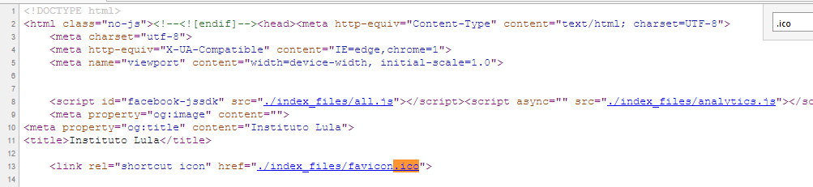

#WEB 20
>Original 16x16 pixels mas até ele se enriqueceu e se transformou em 179x21
Institutolula.com.br


#Site


```Original 16x16 pixels``` De cara dava pra perceber que eles pediam uma imagem com o formato 16x16px
Na lógica uma imagem 16x16 é uma imagem pequena, no caso você teria que procurar a menor 
ou uma das menores imagens contida no site

#Lógica

Um bom observador encontraria de cara uma pequena imagem que aparentava um formato igual ao requerido ```16x16px```


>Um ícone um pouco estranho que parecia um texto "compactado"

Para visualisar o ícone era só ir na source da página e procurar



Poderia salvar o icone no clicando no canto da página
Ou por 
>wget http://ctf.sucurihc.org/flag/lavajato/web20/index_files/favicon.ico

#Flag
Agora era só achar um jeito de visualizar o icone
No site ``` icoconvert.com/icon_to_image_converter ``` você poderia convertelo para um formato " Legivel "
ico to PNG


>HC{TaNaCaRaLuLa}


